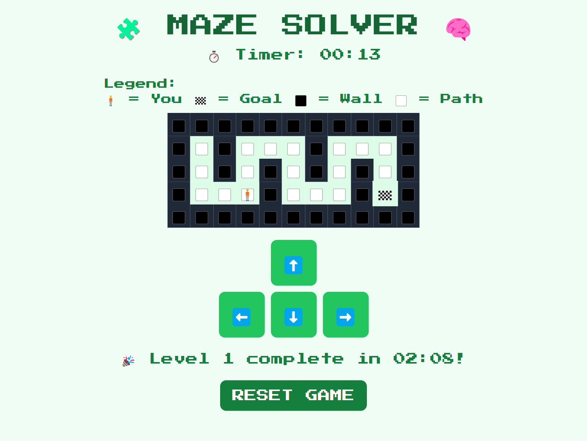

Code with emoji 😎💻

name: Maze Solver

description: Navigate from start to finish in a maze.

features:
- Arrow key movement
- Win detection on reaching goal
- Timer optional

Demo: https://narvs1999.github.io/games_mazesolver/

#html #html5 #webdevelopment #webdesign #frontend #coding #programming #tailwindcss #tailwind #css #webdesign #frontenddevelopment #responsive #uiux #webdev #javascript #js #webdevelopment #frontend #coding #programming #webdev #AI #AIDevelopment #MachineLearning #ArtificialIntelligence #DeepLearning 

